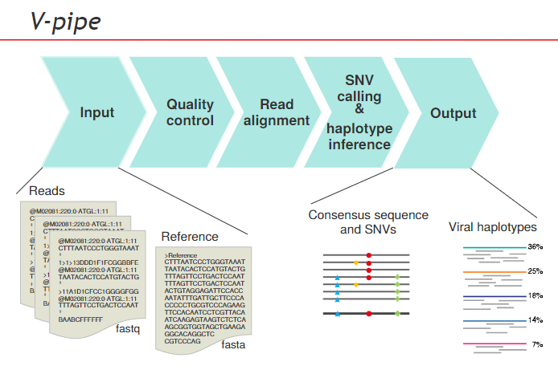

## Table of Contents
- Introduction: V-pipe
- A brief bio-informatics - Glossary
- Config.yaml: what do the terms mean?
- Output: The Samples Directory
- Understand the file extensions

## Introduction: V-pipe
V-pipe: an Apache-licensed computational pipeline for the analysis of virus next-generation sequencing (NGS) data, specializing in samples of mixed viral populations.

### Problem 

RNA viruses have high mutation rates, reproduce very quickly and exist in large population sizes. They exist as mixtures in populations and this present problems when it comes to medical intervention or treatments. Existing methods such as NGS only allow for short reads and prone to errors.

### Solution

V-pipe takes raw data as they come from sequencing machine and using a reference file of target subject, performs quality control, read-alignment, snv calling and haplotype inference to produce several useful files.

## A brief bio-informatics - Glossary

### A
- **Alignment:** the process of arranging sequencing reads alongside a reference genome or another reference sequence.
### B
- **BCFTool:** a command-line tool used for manipulating and analyzing variant call data
### C
- **Consensus Sequence:** the most frequently occuring sequence after aligning multiple RNA sequences
### G
- **Genome:** the complete set of genetic instructions carried by an organism, defining its characteristics and functionalities. It serves as the blueprint for an organism's development, growth, and reproduction.
### I
- **Indexing:**  the process of assigning unique identifiers (indexes) to samples within an RNA sequencing (RNA-Seq) experiment.
### L
- **Lofreq:**  a bioinformatic tool used for variant calling that is well-suited for targeted resequencing data, where sequencing focuses on specific regions of interest in the genome.
### M
- **Mapping:** the process of assigning sequencing (often from RNA-Seq) reads to potential locations within a reference genome
### Q
- **Quality Control:** the process of ensuring the quality and reliability of data throughout a bioinformatics workflow. This involves various techniques employed at different stages to identify and minimize errors or artifacts that might compromise downstream analyses.
### R
- **Reference genome:** the complete or near-complete sequence of an organism, assembled from various sequencing experiments that serves as a standard reference point for analyzing sequencing data. 
### S
- **Sequence read:** a short fragment of DNA or RNA sequence obtained from a high-throughput sequencing experiment.
- **Shorah:** a bioinformatic tool used for variant calling that is primarily designed for variant calling from whole-genome sequencing
- **SNV:** a sequence variation that occurs when a single nucleotide (A,C, G or T) in the genome sequence is altered
### V
- **Variant:** a difference in the DNA sequence at a specific position compared to a reference genome
- **Variant Caller:**  a software tool designed to analyze sequencing data and identify potential variants compared to a reference genome.

## Config.yaml: what do the terms mean?
### general
- **virus_base_config:** defines the reference file to be used based on the already 3 existing diseases i.e monkeypox, sarscov2 or hiv
- **snv_caller:**  defines the variant calling method to be used, by default if not specified, Shorah is used.
### input:
- **samples_file: samples.tsv** this section defines the directory to the input for the pipeline and any other special instructions for processing

### output:
- **datadir - samples/**  outlines the path of where the processed data will be stored
- **trim_primers:** defines a workflow for trimming BAM files based on primers
- **snv:** defines a workflow for calling SNVs using either ShorAh or Lofreq based on the configuration
- **visualization:** allows for  generation of web-based visualizations of Single Nucleotide Variants (SNVs) and alignments from sequencing data.
> disclaimer, can only be activated when snv is set to true.
- **diversity:** this workflow allows efficient calculation and aggregation of diversity statistics for comparative analysis across multiple datasets
- **QA:** this workflow performs pre-processing and quality control (QC) steps on sequencing data
- **dehumanized_raw_reads:** this workflow allows filtering of human contamination/ interference from sequencing data

## Output: The Samples Directory
| Folder | Content Description | SubFolders Description |
| ----------- | ----------- | ----------- |
Alignment | Process of comparing RNA sequences to identify regions of similarities or differences | `basecnt.*/basecounts.*` contains information about individual count of each nucleotide within a specific sequence `bwa_align.*` Burrows-Wheeler Aligner, this file contains info derived from mapping of short RNA sequence reads against a large reference genome. `consensus.*` contains info about consensus sequence. |
Extracted_data | logs info about the process of extracting data from the raw reads in the `*.fastq` files |   -
Preprocessed_data | contains generated summary statistics of sequence and quality data | -
Raw_data | contains raw_reads in `fastq ` files. What are paired reads - explain what this means |
References | What does this file contain?? | `consensus_ambig.*` contains info about positions in the consensus where the exact nucleotide wasn't perfectly conserved across all the aligned sequences. `consensus_sequences.*` data related to consensus sequence generation |
Variants/SNVs | info about difference in sequences compared to a reference genome | `lofreq.*` data obtained from using lofreq variant caller |

## Understand the file extensions
 
| File Extension  | Content|
| ----------- | ----------- |
*.bam | stores the results of aligning sequencing reads to a reference genome | 
*.bam.bai |  an index file associated with the corresponding .bam file| 
*.bcf |  stores information about genetic variations | 
*.benchmark |  contains data about performance testing. data could include metrics used to evaluate the performance of a specific tool, algorithm, or pipeline within the workflow | 
*.chain |  stores information about pairwise alignments between two sequences | 
*.csi |  a CSI index file that goes along with the compressed BCF file and allows for efficient access to specific variant data within the BCF file. | 
*.err.log |  log file that captures error messages from a program | 
*.err.out |  log file that contains informative output messages from the shell commands, potentially alongside any errors redirected to .err.log | 
*.fasta | stores biological data of linear sequences of nucleotides | 
*.fastq |  similar to .fasta, however adds an additional layer of information about the quality of each base in the sequence. | 
*.gz |  file compressed using the GNU zip (gzip) compression format | 
*.tsv |  file containing tab seperated values | 
*.vcf |  variant call format file, stores information about genetic variations | 
|  *.yaml |  stores data in key-value pairs, could be used as configuration files that allow you to customize your workflow etc. | 

